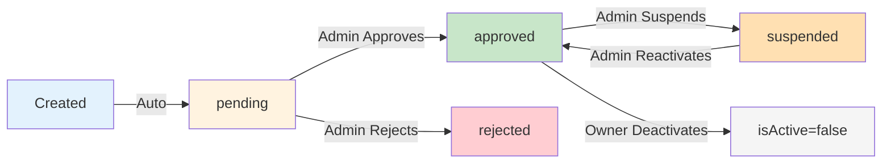
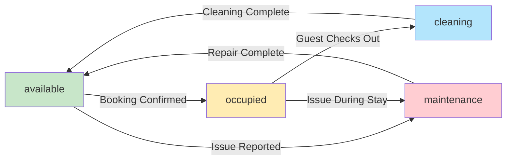
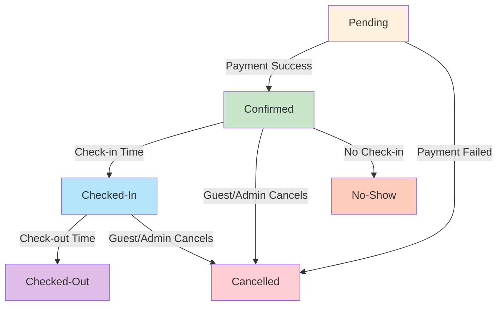
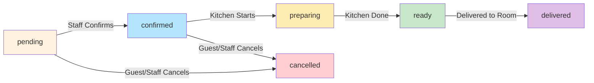
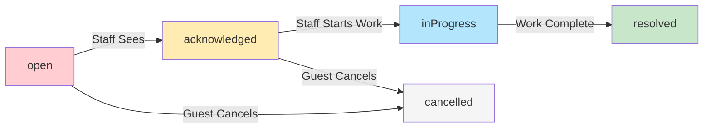
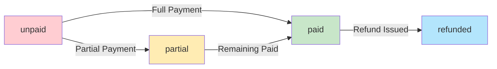

# 🏨 StayHaven Database Design - Business Overview

## What This Database Does

This database powers a complete hotel marketplace where guests can book rooms, order food, and request services — while hotel owners manage their properties and staff handle customer needs in real-time.

**Simple goal:** Keep everything organized, secure, and fast for everyone using the platform.

---

## 🎯 Core Business Entities

### **1. Users**
Everyone on the platform — guests, hotel owners, staff, and admins.

**What it handles:**
- Guest accounts (people booking hotels)
- Hotel owner accounts (people listing properties)
- Staff accounts (people serving guests)
- Admin accounts (platform managers)

**Why separate users by role:**
- Each type of user sees different dashboards
- Guests can book, owners can list hotels, staff can handle orders
- Makes it easy to add new features for specific user types later

---

### **2. Hotels**
The properties listed on the platform.

**What it stores:**
- Hotel name, description, location
- Star rating (1-5 stars)
- Price range (minimum to maximum)
- Photos, amenities (WiFi, pool, parking, etc.)
- Owner information
- Approval status (pending, approved, rejected)

**Why hotels are kept separate:**
- Unlimited hotels can be added without system changes
- Each hotel can be managed independently
- Easy to filter and search by city, price, amenities
- Admins can approve or reject listings before they go live

**Business flow:**
1. Owner creates hotel listing
2. Status = "Pending" (not visible to guests yet)
3. Admin reviews and approves
4. Status = "Approved" (now guests can see it)

---

### **3. Rooms**
Individual rooms within each hotel.

**What it stores:**
- Room type (single, double, suite, deluxe, villa)
- Room number
- Price per night
- Status (available, occupied, maintenance, cleaning)
- Capacity (adults and children)
- Amenities (specific to the room)
- Photos

**Why rooms are separate from hotels:**
- Not all rooms in a hotel are the same
- Owners can update price and availability room-by-room
- Guests can see exactly what they're booking
- System can prevent double-bookings automatically

**Business benefit:** Flexible pricing and better inventory control.

---

### **4. Bookings**
When a guest reserves a room.

**What it tracks:**
- Guest who made the booking
- Hotel and room booked
- Check-in and check-out dates
- Number of guests (adults + children)
- Total amount to pay
- Booking status (Pending → Confirmed → Checked-In → Checked-Out)
- Payment status (Unpaid → Paid)
- Unique confirmation code

**Booking lifecycle:**
```
Guest selects room
    ↓
System checks availability
    ↓
Booking created (Status: Pending, Payment: Unpaid)
    ↓
Payment processed (Payment: Paid)
    ↓
Booking confirmed (Status: Confirmed)
    ↓
Guest arrives (Status: Checked-In)
    ↓
Guest leaves (Status: Checked-Out)
```

**Why this matters:**
- Prevents double-bookings (same room, same dates)
- Tracks money flow accurately
- Guests get confirmation codes for their records
- Owners see booking history and revenue

---

### **5. Menu Items**
Food and drinks available for order at each hotel.

**What it stores:**
- Item name, description, price
- Category (Breakfast, Lunch, Dinner, Snacks, Drinks, Desserts)
- Photos
- Availability (in stock or sold out)
- Preparation time
- Dietary information (Vegetarian, Vegan, Gluten-Free, etc.)
- Allergen warnings

**Why each hotel has its own menu:**
- Different hotels offer different food
- Prices vary by location and hotel quality
- Owners control what they want to serve
- Easy to add seasonal items or daily specials

**Business benefit:** Increases revenue by making in-room dining easy.

---

### **6. Orders**
When guests order food or drinks to their room.

**What it tracks:**
- Guest who ordered
- Room number
- Items ordered (with quantities and prices)
- Total price
- Order type (Room Service, Dine-In, Takeaway)
- Status (Pending → Confirmed → Preparing → Ready → Delivered)
- Priority (Normal or High)
- Preparation time

**Order lifecycle:**
```
Guest places order from room
    ↓
Status: Pending
    ↓
Kitchen receives (Status: Confirmed)
    ↓
Kitchen starts (Status: Preparing)
    ↓
Food ready (Status: Ready)
    ↓
Delivered to room (Status: Delivered)
```

**Why this structure works:**
- Kitchen staff see orders in real-time
- Guests know exactly when food will arrive
- Hotel tracks which rooms order the most (analytics)
- System prevents mistakes (wrong room, wrong items)

---

### **7. Waiter Calls / Service Requests**
When guests need assistance (cleaning, maintenance, checkout help).

**What it tracks:**
- Guest who made the request
- Room number
- Request type (Cleaning, Maintenance, Emergency, etc.)
- Priority (Low, Medium, High, Urgent)
- Status (Open → Acknowledged → In Progress → Resolved)
- Assigned staff member
- Notes and resolution details

**Request flow:**
```
Guest presses service button
    ↓
Request created (Status: Open)
    ↓
Staff sees notification (Status: Acknowledged)
    ↓
Staff working on it (Status: In Progress)
    ↓
Issue fixed (Status: Resolved)
```

**Business benefit:**
- Guests get help faster
- Staff knows exactly what's needed and where
- Management tracks response times (quality control)
- Emergency requests are prioritized automatically

---

### **8. Notifications**
System alerts sent to users (bookings confirmed, orders ready, etc.).

**What it handles:**
- Booking confirmations
- Payment receipts
- Order updates
- Hotel approval/rejection messages
- Service request updates
- Promotional offers

**Why notifications are separate:**
- Users can check their notification history anytime
- System tracks which messages were read
- Different priority levels (Low, Medium, High)
- Each notification can link to relevant page (booking details, order status)

**Business benefit:** Keeps users informed without manual work.

---

### **9. Reviews** (Coming Soon)
Guest feedback after their stay.

**What it stores:**
- Star rating (1-5)
- Detailed ratings (Cleanliness, Staff, Facilities, Location, Value)
- Written review
- Photos (optional)
- Verified stay badge (only real guests can review)
- Hotel owner response (optional)

**Why reviews matter:**
- Builds trust with new guests
- Helps hotels improve service
- Increases booking conversion rates
- Verified reviews prevent fake feedback

**Business benefit:** Social proof = more bookings.

---

### **10. Roles & Permissions**
Controls what each user type can do.

**Four main roles:**
1. **Guest** - Browse hotels, make bookings, order food, call for service
2. **Hotel Owner** - Create/edit hotels, manage rooms, view revenue stats
3. **Staff** - Handle food orders, respond to service calls
4. **Admin** - Approve hotels, manage users, access all data

**Why this matters:**
- Guests can't see other people's bookings (privacy)
- Owners can't approve their own hotels (fairness)
- Staff only see their assigned tasks (focus)
- Admins control quality (approve/reject hotels)

---

## 🔄 How Data Flows Through the System

### **Scenario 1: Guest Books a Hotel**

**Step 1:** Guest searches for hotels in a city
- System fetches from **Hotels** (only approved ones)
- Filters by price, rating, amenities

**Step 2:** Guest picks a hotel and views rooms
- System fetches from **Rooms** (linked to that hotel)
- Shows only available rooms for selected dates

**Step 3:** Guest books a room
- System checks **Bookings** (no overlap on same room)
- Creates new booking (Status: Pending, Payment: Unpaid)

**Step 4:** Guest pays
- Payment processed
- Booking updated (Status: Confirmed, Payment: Paid)
- Confirmation code generated

**Step 5:** Notifications sent
- Guest receives confirmation email
- Hotel owner gets "New Booking" alert
- Both stored in **Notifications**

**Result:** Guest has a confirmed reservation, owner knows a room is booked, money tracked accurately.

---

### **Scenario 2: Guest Orders Food**

**Step 1:** Guest opens menu on phone/tablet
- System fetches **Menu Items** for that hotel
- Shows only available items

**Step 2:** Guest adds items and places order
- **Order** created with items, quantities, prices
- Status: Pending

**Step 3:** Kitchen staff sees order
- Order appears on their screen
- Staff confirms (Status: Confirmed → Preparing)

**Step 4:** Food prepared and delivered
- Status: Ready → Delivered
- Timestamp recorded

**Step 5:** Guest gets notification
- "Your order has been delivered"
- Stored in **Notifications**

**Result:** Fast service, no miscommunication, kitchen organized.

---

### **Scenario 3: Guest Needs Room Cleaning**

**Step 1:** Guest presses "Request Cleaning" button
- **Waiter Call** created
- Request Type: Cleaning
- Status: Open

**Step 2:** Staff gets notification immediately
- Alert appears on staff dashboard
- Staff acknowledges (Status: Acknowledged)

**Step 3:** Staff goes to room
- Status: In Progress

**Step 4:** Room cleaned
- Status: Resolved
- Timestamp recorded

**Result:** Guest helped quickly, management can track how fast staff responds.

---

### **Scenario 4: Hotel Owner Lists a Property**

**Step 1:** Owner signs up and creates hotel
- Fills form: name, location, photos, amenities, pricing
- **Hotel** created (Status: Pending)

**Step 2:** Admin reviews
- Admin sees pending hotels in dashboard
- Checks if info is complete and legitimate

**Step 3:** Admin approves
- Status: Approved
- Hotel now visible to all guests

**Step 4:** Owner adds rooms
- Creates **Rooms** for that hotel
- Sets prices, types, availability

**Step 5:** Bookings start coming in
- Owner sees revenue stats on dashboard
- Data fetched from **Bookings** linked to their hotel

**Result:** Quality control maintained, only real hotels listed.

---

## 🔐 Security & Data Integrity

**How the system stays secure:**

1. **User passwords are encrypted** (never stored as plain text)
2. **Booking conflicts prevented** (same room can't be double-booked)
3. **Payments tracked separately** (audit trail for every transaction)
4. **Only verified guests can review** (must have completed stay)
5. **Role-based access** (users only see what they should)
6. **Admin approval required** (prevents fake hotel listings)

**Data accuracy:**
- Every booking is linked to a specific user, hotel, and room
- Orders are linked to menu items (prevents price changes after order)
- Notifications are linked to relevant actions (booking ID, order ID)
- Everything is timestamped (know exactly when things happened)

---

## 📊 Business Intelligence (What You Can Analyze)

With this database structure, you can easily answer:

**For Admins:**
- How many bookings this month?
- Which hotels are most popular?
- What's the average booking value?
- Which cities get the most searches?

**For Hotel Owners:**
- How much revenue did I make?
- Which room types book fastest?
- What's my average guest rating?
- How many food orders came from guests?

**For Guests:**
- My booking history
- Past orders
- Reviews I've written
- Favorite hotels (wishlist)

**For Staff:**
- Open service requests
- Today's food orders
- Response time averages

---

## 🚀 Scalability (Future-Proof Design)

**What can be added later without breaking anything:**

### Easy additions:
- **Loyalty program** - Add points to User model
- **Gift cards** - New Voucher collection
- **Multi-hotel chains** - Link hotels under one parent company
- **Dynamic pricing** - Adjust room prices based on demand
- **Multi-language support** - Add language preferences to users
- **Analytics dashboard** - Already have all the data needed
- **Mobile app** - Same database works for web and mobile
- **Chatbot support** - Can access all booking/order data

### Already prepared for:
- Unlimited hotels
- Unlimited users
- Any number of rooms per hotel
- Multiple currencies (USD, EUR, INR, NPR)
- Different time zones
- Seasonal promotions and discounts

---

## 📈 Business Benefits Summary

| Feature | Benefit |
|---------|---------|
| **Separate Hotels & Rooms** | Flexible pricing, better inventory control |
| **Booking System** | Prevents double-bookings, tracks revenue accurately |
| **Order System** | Increases revenue, improves guest experience |
| **Service Requests** | Faster response times, better guest satisfaction |
| **Reviews** | Builds trust, increases bookings |
| **Admin Approval** | Maintains quality, prevents fraud |
| **Notifications** | Keeps everyone informed automatically |
| **Role-Based Access** | Security and privacy for all users |
| **Audit Trail** | Every action is tracked and timestamped |
| **Analytics-Ready** | Make data-driven business decisions |

---

## 🎯 Why This Design Works

**1. Clarity** - Each entity has a clear, single purpose  
**2. Flexibility** - Easy to add features without redesigning  
**3. Security** - User data is protected, roles enforced  
**4. Speed** - Optimized for fast searches and updates  
**5. Scalability** - Works for 10 hotels or 10,000 hotels  
**6. Reliability** - Prevents errors like double-bookings  
**7. Analytics** - All data structured for insights  

---

## 📋 Status Flow Reference

### Booking Status Flow
```
Pending → Confirmed → Checked-In → Checked-Out
                   ↓
                Cancelled (if guest cancels)
                   ↓
                No-Show (if guest doesn't arrive)
```

### Order Status Flow
```
Pending → Confirmed → Preparing → Ready → Delivered
                                    ↓
                               Cancelled (if guest cancels)
```

### Waiter Call Status Flow
```
Open → Acknowledged → In Progress → Resolved
                                  ↓
                              Cancelled (if not needed)
```

### Hotel Approval Flow
```
Pending → Approved (visible to guests)
       ↓
     Rejected (owner notified)
       ↓
   Suspended (admin action if issues found later)
```

### Payment Status Flow
```
Unpaid → Paid → (stay completed)
              ↓
          Refunded (if booking cancelled)
```

---

## 🔗 How Everything Connects

```
USER (Guest)
  ↓
Makes → BOOKING
          ↓
      For → ROOM
              ↓
          In → HOTEL
                 ↓
              Owned by → USER (Hotel Owner)

USER (Guest in room)
  ↓
Places → ORDER
          ↓
      From → MENU ITEMS
                ↓
             At → HOTEL

USER (Guest in room)
  ↓
Raises → WAITER CALL
            ↓
        For → ROOM
                ↓
             In → HOTEL
                    ↓
               Assigned to → USER (Staff)

USER (Guest after checkout)
  ↓
Writes → REVIEW (Coming Soon)
           ↓
       For → HOTEL
```

---

## 💡 Final Summary

**This database is designed so:**

✅ **Customers can book hotels smoothly** (no double-bookings, instant confirmation)  
✅ **Admins can manage listings easily** (approve/reject, feature hotels, monitor quality)  
✅ **Payments stay secure** (every transaction tracked)  
✅ **The system can grow** (add unlimited hotels, rooms, features)  
✅ **Business insights are automatic** (revenue, bookings, ratings all tracked)  
✅ **Guest experience is seamless** (book rooms, order food, call for help — all connected)

**Built for reliability, security, and scale.**

---

## 📚 Technical Schema Details

### 1. User Schema

**Collection:** `users`  
**Purpose:** Stores all user accounts (guests, owners, staff, admins)

#### Fields

| Field | Type | Required | Default | Description |
|-------|------|----------|---------|-------------|
| `fullname` | String | ✅ | - | User's full name (min 3 chars) |
| `username` | String | ✅ | - | Unique username (lowercase, trimmed) |
| `email` | String | ✅ | - | Unique email (lowercase, validated) |
| `password` | String | ✅ | - | bcrypt hashed password |
| `profilePicture` | String | ❌ | null | URL to profile image |
| `role` | ObjectId | ❌ | guest | Reference to Role collection |
| `roomNumber` | String | ❌ | null | Current room (for guests) |
| `contact` | String | ❌ | - | Phone number |
| `isActive` | Boolean | ❌ | true | Account status (soft delete) |
| `resetOtp` | String | ❌ | "" | Password reset OTP |
| `resetOtpExpireAt` | Number | ❌ | 0 | OTP expiration timestamp |
| `isGoogleUser` | Boolean | ❌ | false | Google OAuth flag |
| `googleId` | String | ❌ | null | Google account ID |
| `wishlist` | [String] | ❌ | [] | Array of hotel IDs |
| `cart` | [Object] | ❌ | [] | Shopping cart items |

#### Indexes

```javascript
{ email: 1 }           // Unique
{ username: 1 }        // Unique
{ googleId: 1 }        // Sparse unique
{ role: 1 }
```

#### Pre-Save Hooks

```javascript
// Hash password before saving
userSchema.pre('save', async function(next) {
  if (this.isModified('password')) {
    this.password = await bcrypt.hash(this.password, 10);
  }
  next();
});
```

#### Methods

```javascript
matchPassword(enteredPassword) // Compare password with hash
```

#### Relationships

- **1:M with Hotels** (as owner)
- **1:M with Bookings** (as guest)
- **1:M with Orders** (as customer)
- **1:M with WaiterCalls** (as requester)
- **1:M with Notifications** (as recipient)
- **M:1 with Role**

---

### 2. Role Schema

**Collection:** `roles`  
**Purpose:** Defines user roles and permissions (RBAC)

#### Fields

| Field | Type | Required | Default | Description |
|-------|------|----------|---------|-------------|
| `name` | String | ✅ | - | Unique role name (enum) |
| `permissions` | [String] | ❌ | [] | Array of permission strings |
| `description` | String | ❌ | - | Role description |
| `isSystemRole` | Boolean | ❌ | false | Cannot be deleted if true |

#### Enums

```javascript
name: ['admin', 'staff', 'guest', 'owner']
```

#### Permission Examples

```javascript
[
  'hotel:create',
  'hotel:edit',
  'hotel:delete',
  'booking:view',
  'booking:approve',
  'user:manage',
  'order:manage',
  'stats:view'
]
```

#### Indexes

```javascript
{ name: 1 }  // Unique
```

#### Role Definitions

| Role | Permissions | Description |
|------|-------------|-------------|
| **guest** | Browse hotels, create bookings, place orders | Default role for customers |
| **owner** | Manage own hotels, view bookings, manage rooms | Hotel property owners |
| **staff** | Manage orders, handle waiter calls, update statuses | Hotel employees |
| **admin** | All permissions, approve hotels, manage users | Platform administrators |

---

### 3. Hotel Schema

**Collection:** `hotels`  
**Purpose:** Hotel property listings

#### Fields

| Field | Type | Required | Default | Description |
|-------|------|----------|---------|-------------|
| `name` | String | ✅ | - | Hotel name |
| `description` | String | ✅ | - | Detailed description |
| `owner` | ObjectId | ✅ | - | Reference to User (owner) |
| `location.city` | String | ✅ | - | City name |
| `location.address` | String | ✅ | - | Full address |
| `location.coordinates` | Object | ❌ | - | {latitude, longitude} |
| `category` | String | ✅ | - | Hotel type (enum) |
| `rating` | Number | ❌ | 0 | Average rating (0-5) |
| `reviewCount` | Number | ❌ | 0 | Total reviews |
| `starRating` | Number | ✅ | - | Star classification (1-5) |
| `priceRange.min` | Number | ✅ | - | Minimum room price |
| `priceRange.max` | Number | ✅ | - | Maximum room price |
| `images` | [String] | ✅ | - | Array of image URLs (min 1) |
| `amenities` | [String] | ❌ | [] | Available facilities |
| `policies.checkIn` | String | ❌ | "2:00 PM" | Check-in time |
| `policies.checkOut` | String | ❌ | "12:00 PM" | Check-out time |
| `policies.cancellationPolicy` | String | ❌ | "Free cancellation up to 24 hours" | Cancellation terms |
| `policies.petPolicy` | String | ❌ | "Pets not allowed" | Pet rules |
| `contact.phone` | String | ✅ | - | Contact number |
| `contact.email` | String | ✅ | - | Contact email |
| `contact.website` | String | ❌ | - | Website URL |
| `status` | String | ❌ | pending | Approval status (enum) |
| `isActive` | Boolean | ❌ | true | Soft delete flag |
| `featured` | Boolean | ❌ | false | Featured on homepage |
| `totalRooms` | Number | ❌ | 0 | Total room count |
| `availableRooms` | Number | ❌ | 0 | Available room count |
| `totalBookings` | Number | ❌ | 0 | Lifetime bookings |
| `totalRevenue` | Number | ❌ | 0 | Lifetime revenue |

#### Enums

```javascript
category: ['Hotel', 'Resort', 'Villa', 'Apartment', 'Guest House', 'Hostel']
starRating: [1, 2, 3, 4, 5]
status: ['pending', 'approved', 'rejected', 'suspended']
```

#### Indexes

```javascript
{ name: 'text', description: 'text' }  // Full-text search
{ 'location.city': 1 }
{ category: 1 }
{ starRating: 1 }
{ rating: -1 }
{ owner: 1 }
```

#### Status Flow

```
pending → approved ──→ (active)
   │                       │
   └──→ rejected       suspended
```

#### Relationships

- **M:1 with User** (owner)
- **1:M with Rooms**
- **1:M with Bookings**
- **1:M with MenuItems**
- **1:M with Orders**
- **1:M with WaiterCalls**

---

### 4. Room Schema

**Collection:** `rooms`  
**Purpose:** Individual hotel rooms

#### Fields

| Field | Type | Required | Default | Description |
|-------|------|----------|---------|-------------|
| `hotel` | ObjectId | ✅ | - | Reference to Hotel |
| `roomName` | String | ✅ | - | Room name/title |
| `roomNumber` | String | ✅ | - | Unique room number |
| `type` | String | ✅ | - | Room type (enum) |
| `price` | Number | ✅ | - | Price per night |
| `status` | String | ✅ | available | Room status (enum) |
| `description` | String | ❌ | - | Room description |
| `amenities` | [String] | ❌ | [] | Room-specific amenities |
| `images` | [String] | ❌ | [] | Room images |
| `capacity.adults` | Number | ❌ | 2 | Max adults |
| `capacity.children` | Number | ❌ | 0 | Max children |
| `bedType` | String | ❌ | - | Bed type (enum) |
| `QR` | String | ❌ | - | QR code for room services |

#### Enums

```javascript
type: ['single', 'double', 'suite', 'deluxe', 'villa']
status: ['available', 'occupied', 'maintenance', 'cleaning']
bedType: ['Single', 'Double', 'Queen', 'King', 'Twin']
```

#### Indexes

```javascript
{ hotel: 1, roomNumber: 1 }  // Unique compound
{ hotel: 1, status: 1 }
```

#### Status Flow

```
available → occupied → cleaning → available
    │                      │
    └──→ maintenance ──────┘
```

#### Relationships

- **M:1 with Hotel**
- **1:M with Bookings**
- **1:M with Orders**
- **1:M with WaiterCalls**

---

### 5. Booking Schema

**Collection:** `bookings`  
**Purpose:** Hotel room reservations

#### Fields

| Field | Type | Required | Default | Description |
|-------|------|----------|---------|-------------|
| `user` | ObjectId | ✅ | - | Reference to User (guest) |
| `hotel` | ObjectId | ✅ | - | Reference to Hotel (denormalized) |
| `room` | ObjectId | ✅ | - | Reference to Room |
| `checkIn` | Date | ✅ | - | Check-in date |
| `checkOut` | Date | ✅ | - | Check-out date |
| `guests.adults` | Number | ✅ | - | Number of adults (1-10) |
| `guests.children` | Number | ❌ | 0 | Number of children (0-8) |
| `totalAmount` | Number | ✅ | - | Total booking cost |
| `currency` | String | ❌ | USD | Currency code |
| `status` | String | ❌ | Pending | Booking status (enum) |
| `paymentStatus` | String | ❌ | unpaid | Payment status (enum) |
| `confirmationCode` | String | ❌ | - | Unique booking code |
| `specialRequests` | String | ❌ | - | Guest requests (max 500) |
| `cancellationReason` | String | ❌ | - | Reason for cancellation |
| `cancelledAt` | Date | ❌ | - | Cancellation timestamp |
| `cancelledBy` | ObjectId | ❌ | - | Who cancelled (user ref) |
| `bookingSource` | String | ❌ | web | Booking origin |

#### Enums

```javascript
status: ['Pending', 'Confirmed', 'Checked-In', 'Checked-Out', 'Cancelled', 'No-Show']
paymentStatus: ['unpaid', 'partial', 'paid', 'refunded']
currency: ['USD', 'EUR', 'GBP', 'INR', 'NPR']
bookingSource: ['web', 'mobile', 'admin', 'api']
```

#### Indexes

```javascript
{ user: 1, status: 1 }
{ room: 1, checkIn: 1, checkOut: 1 }  // Prevent overlaps
{ hotel: 1, status: 1 }
{ confirmationCode: 1 }
{ createdAt: -1 }
```

#### Status Flow

```
Pending → Confirmed → Checked-In → Checked-Out
   │          │            │
   └──────────┴────────────┴──→ Cancelled
                           │
                           └──→ No-Show
```

#### Payment Status Flow

```
unpaid → partial → paid
            │        │
            └────────┴──→ refunded
```

#### Validation Rules

- `checkOut` must be after `checkIn`
- Room must be `available` when booking
- `guests.adults` >= 1
- Cannot book if room is already booked for overlapping dates

#### Relationships

- **M:1 with User** (guest)
- **M:1 with Hotel** (denormalized for speed)
- **M:1 with Room**
- **1:1 with Payment** (future)
- **1:1 with Review** (future)

---

### 6. Order Schema

**Collection:** `orders`  
**Purpose:** In-hotel food and service orders

#### Fields

| Field | Type | Required | Default | Description |
|-------|------|----------|---------|-------------|
| `hotel` | ObjectId | ✅ | - | Reference to Hotel |
| `room` | ObjectId | ✅ | - | Reference to Room |
| `roomNumber` | String | ✅ | - | Room number (denormalized) |
| `orderBy` | ObjectId | ✅ | - | Reference to User |
| `items` | [Object] | ✅ | - | Array of ordered items |
| `items.menuItem` | ObjectId | ✅ | - | Reference to MenuItem |
| `items.name` | String | ✅ | - | Item name (snapshot) |
| `items.quantity` | Number | ✅ | - | Quantity (min 1) |
| `items.price` | Number | ✅ | - | Price (snapshot) |
| `totalPrice` | Number | ✅ | - | Total order cost |
| `orderType` | String | ❌ | roomService | Order type (enum) |
| `status` | String | ❌ | pending | Order status (enum) |
| `priority` | String | ❌ | normal | Order priority |
| `notes` | String | ❌ | - | Special instructions (max 300) |
| `preparationTime` | Number | ❌ | - | Prep time in minutes |
| `deliveredAt` | Date | ❌ | - | Delivery timestamp |

#### Enums

```javascript
orderType: ['roomService', 'dineIn', 'takeaway']
status: ['pending', 'confirmed', 'preparing', 'ready', 'delivered', 'cancelled']
priority: ['normal', 'high']
```

#### Indexes

```javascript
{ room: 1, status: 1 }
{ hotel: 1, status: 1 }
{ orderBy: 1, createdAt: -1 }
{ status: 1, createdAt: -1 }
```

#### Status Flow

```
pending → confirmed → preparing → ready → delivered
   │          │            │        │
   └──────────┴────────────┴────────┴──→ cancelled
```

#### Business Rules

- Items are embedded with snapshots (name, price) for historical accuracy
- Original MenuItem reference maintained for menu updates
- `totalPrice` should equal sum of `items[].quantity * items[].price`
- Staff can update status progressively
- Guests can cancel only if status is `pending` or `confirmed`

#### Relationships

- **M:1 with Hotel**
- **M:1 with Room**
- **M:1 with User** (orderBy)
- **M:M with MenuItem** (via items array)

---

### 7. MenuItem Schema

**Collection:** `menuitems`  
**Purpose:** Hotel restaurant menu items

#### Fields

| Field | Type | Required | Default | Description |
|-------|------|----------|---------|-------------|
| `hotel` | ObjectId | ✅ | - | Reference to Hotel |
| `name` | String | ✅ | - | Item name |
| `description` | String | ❌ | - | Item description (max 500) |
| `category` | String | ✅ | - | Food category (enum) |
| `price` | Number | ✅ | - | Item price (min 0) |
| `image` | String | ❌ | - | Image URL |
| `isAvailable` | Boolean | ❌ | true | Availability status |
| `orderType` | String | ❌ | Others | Service type |
| `preparationTime` | Number | ❌ | 15 | Prep time (5-120 min) |
| `spiceLevel` | String | ❌ | - | Spice level (enum) |
| `dietary` | [String] | ❌ | [] | Dietary tags |
| `allergens` | [String] | ❌ | [] | Allergen information |

#### Enums

```javascript
category: ['Breakfast', 'Lunch', 'Dinner', 'Snacks', 'Drinks', 'Dessert', 'Appetizers']
orderType: ['KOT', 'BOT', 'Dine-In', 'Takeaway', 'Delivery', 'Room Service', 'Others']
spiceLevel: ['mild', 'medium', 'hot', 'very-hot', 'none']
dietary: ['vegetarian', 'vegan', 'gluten-free', 'dairy-free', 'halal', 'kosher', 'none']
```

#### Indexes

```javascript
{ hotel: 1, category: 1 }
{ hotel: 1, isAvailable: 1 }
{ name: 'text', description: 'text' }  // Full-text search
```

#### Business Rules

- Menu items belong to specific hotels
- Price updates don't affect existing orders (snapshot design)
- Can be filtered by dietary preferences
- Allergen information displayed for safety
- `isAvailable` can be toggled for out-of-stock items

#### Relationships

- **M:1 with Hotel**
- **Referenced by Orders** (embedded in items array)

---

### 8. WaiterCall Schema

**Collection:** `waitercalls`  
**Purpose:** Guest service requests

#### Fields

| Field | Type | Required | Default | Description |
|-------|------|----------|---------|-------------|
| `hotel` | ObjectId | ✅ | - | Reference to Hotel |
| `room` | ObjectId | ✅ | - | Reference to Room |
| `roomNumber` | String | ✅ | - | Room number (denormalized) |
| `raisedBy` | ObjectId | ✅ | - | Reference to User (guest) |
| `requestType` | String | ❌ | other | Type of request (enum) |
| `priority` | String | ❌ | medium | Request priority |
| `description` | String | ❌ | - | Request details (max 500) |
| `status` | String | ❌ | open | Request status (enum) |
| `assignedTo` | ObjectId | ❌ | - | Reference to User (staff) |
| `acknowledgedAt` | Date | ❌ | - | Staff acknowledgment time |
| `resolvedAt` | Date | ❌ | - | Resolution time |
| `notes` | String | ❌ | - | Staff notes (max 500) |

#### Enums

```javascript
requestType: ['cleaning', 'maintenance', 'roomService', 'emergency', 'checkout', 'assistance', 'other']
priority: ['low', 'medium', 'high', 'urgent']
status: ['open', 'acknowledged', 'inProgress', 'resolved', 'cancelled']
```

#### Indexes

```javascript
{ hotel: 1, status: 1 }
{ room: 1, status: 1 }
{ assignedTo: 1, status: 1 }
{ priority: -1, createdAt: 1 }  // Sort by priority
```

#### Status Flow

```
open → acknowledged → inProgress → resolved
  │          │              │
  └──────────┴──────────────┴──→ cancelled
```

#### Priority Assignment Rules

| Request Type | Auto Priority |
|--------------|---------------|
| emergency | urgent |
| checkout | high |
| maintenance | medium |
| cleaning | medium |
| roomService | normal |
| other | low |

#### Business Rules

- Guests can raise requests from their rooms
- Staff members can be assigned to requests
- `acknowledgedAt` set when status changes to `acknowledged`
- `resolvedAt` set when status changes to `resolved`
- High priority requests appear first in staff dashboard
- Emergency requests trigger immediate notifications

#### Relationships

- **M:1 with Hotel**
- **M:1 with Room**
- **M:1 with User** (raisedBy - guest)
- **M:1 with User** (assignedTo - staff)

---

### 9. Notification Schema

**Collection:** `notifications`  
**Purpose:** System and user notifications

#### Fields

| Field | Type | Required | Default | Description |
|-------|------|----------|---------|-------------|
| `user` | ObjectId | ✅ | - | Reference to User (recipient) |
| `sender` | ObjectId | ❌ | - | Reference to User (optional) |
| `type` | String | ✅ | - | Notification type (enum) |
| `title` | String | ✅ | - | Notification title (max 100) |
| `message` | String | ✅ | - | Notification message (max 500) |
| `priority` | String | ❌ | medium | Priority level |
| `actionUrl` | String | ❌ | - | Deep link to action |
| `payload` | Map | ❌ | - | Additional data (key-value) |
| `isRead` | Boolean | ❌ | false | Read status |
| `readAt` | Date | ❌ | - | Read timestamp |

#### Enums

```javascript
type: [
  'booking_confirmed',
  'booking_cancelled',
  'booking_reminder',
  'payment_received',
  'payment_failed',
  'review_received',
  'hotel_approved',
  'hotel_rejected',
  'hotel_suspended',
  'order_status',
  'order_delivered',
  'waiter_call',
  'waiter_call_resolved',
  'system',
  'promotional',
  'account'
]

priority: ['low', 'medium', 'high']
```

#### Indexes

```javascript
{ user: 1, isRead: 1, createdAt: -1 }
{ type: 1 }
{ priority: -1, createdAt: -1 }
```

#### Notification Types & Triggers

| Type | Triggered By | Recipients |
|------|--------------|------------|
| `booking_confirmed` | Booking status → Confirmed | Guest |
| `booking_cancelled` | Booking cancelled | Guest, Owner |
| `booking_reminder` | 24h before check-in | Guest |
| `payment_received` | Payment completed | Guest, Owner |
| `payment_failed` | Payment failed | Guest |
| `review_received` | Guest leaves review | Owner |
| `hotel_approved` | Admin approves hotel | Owner |
| `hotel_rejected` | Admin rejects hotel | Owner |
| `hotel_suspended` | Admin suspends hotel | Owner |
| `order_status` | Order status changes | Guest |
| `order_delivered` | Order delivered | Guest |
| `waiter_call` | New waiter call | Staff |
| `waiter_call_resolved` | Call resolved | Guest |
| `system` | System events | All users |
| `promotional` | Marketing campaigns | Subscribed users |
| `account` | Account changes | User |

#### Payload Examples

```javascript
// Booking confirmed
{
  payload: {
    bookingId: '507f1f77bcf86cd799439011',
    hotelName: 'Grand Plaza Hotel',
    checkIn: '2025-12-01',
    checkOut: '2025-12-05',
    confirmationCode: 'STAY2025XYZ'
  }
}

// Order delivered
{
  payload: {
    orderId: '507f1f77bcf86cd799439012',
    roomNumber: '305',
    totalPrice: 45.99
  }
}

// Hotel approved
{
  payload: {
    hotelId: '507f1f77bcf86cd799439013',
    hotelName: 'Sunset Resort'
  }
}
```

#### Business Rules

- System notifications have no `sender`
- `readAt` timestamp set when `isRead` changes to `true`
- `actionUrl` provides deep link (e.g., `/bookings/507f1f77bcf86cd799439011`)
- High priority notifications displayed prominently
- Notifications auto-deleted after 90 days (optional TTL)

#### Relationships

- **M:1 with User** (recipient)
- **M:1 with User** (sender, optional)
- **Referenced by all entities** (via payload)

---

## Status Flow Diagrams

### 🏨 Hotel Status Flow



**States:**
- `pending`: Awaiting admin review (owner cannot edit)
- `approved`: Live and visible to guests
- `rejected`: Not approved (owner can resubmit after edits)
- `suspended`: Temporarily disabled by admin
- `isActive=false`: Soft deleted by owner

---

### 🛏️ Room Status Flow



**States:**
- `available`: Ready for booking
- `occupied`: Guest checked in
- `cleaning`: Being cleaned after checkout
- `maintenance`: Under repair/maintenance

---

### 📅 Booking Status Flow



**States:**
- `Pending`: Awaiting payment
- `Confirmed`: Payment received, booking confirmed
- `Checked-In`: Guest has checked in
- `Checked-Out`: Guest has checked out (completed)
- `Cancelled`: Cancelled by guest/admin
- `No-Show`: Guest didn't arrive at check-in time

**Payment Status:**
- `unpaid` → `partial` → `paid` → `refunded` (independent flow)

---

### 🍽️ Order Status Flow



**States:**
- `pending`: Order placed, awaiting confirmation
- `confirmed`: Staff confirmed, sent to kitchen
- `preparing`: Being prepared
- `ready`: Ready for delivery/pickup
- `delivered`: Delivered to guest (completed)
- `cancelled`: Cancelled before delivery

---

### 🔔 WaiterCall Status Flow



**States:**
- `open`: Request raised, awaiting response
- `acknowledged`: Staff acknowledged, will handle soon
- `inProgress`: Staff actively working on request
- `resolved`: Request completed
- `cancelled`: Guest cancelled request

---

### 💳 Payment Status Flow



**States:**
- `unpaid`: No payment received
- `partial`: Partial payment (e.g., deposit)
- `paid`: Fully paid
- `refunded`: Refund processed

---

## Schema Interactions

### 🔄 Complete Booking Workflow

```
1. USER SEARCHES HOTELS
   ├─ Query: hotels collection (filters, location, price)
   ├─ Returns: Array of Hotel documents
   └─ Populate: owner details (User)

2. USER VIEWS HOTEL DETAILS
   ├─ Query: hotels.findById()
   ├─ Query: rooms.find({ hotel, status: 'available' })
   └─ Returns: Hotel + available rooms

3. USER CREATES BOOKING
   ├─ Check: Room availability (no overlapping bookings)
   ├─ Create: Booking document (status: Pending)
   ├─ Update: Room.status → occupied (after confirmation)
   ├─ Update: Hotel.totalRooms, availableRooms
   ├─ Create: Notification (booking_confirmed)
   └─ Trigger: Email notification

4. BOOKING CONFIRMED (Payment Success)
   ├─ Update: Booking.status → Confirmed
   ├─ Update: Booking.paymentStatus → paid
   ├─ Generate: Booking.confirmationCode
   ├─ Create: Payment document
   ├─ Update: Hotel.totalBookings++
   ├─ Update: Hotel.totalRevenue += totalAmount
   └─ Create: Notification → Guest & Owner

5. CHECK-IN
   ├─ Update: Booking.status → Checked-In
   ├─ Update: Room.status → occupied
   └─ Create: Notification → Guest

6. GUEST ORDERS FOOD
   ├─ Query: menuitems.find({ hotel, isAvailable: true })
   ├─ Create: Order document
   ├─ Create: Notification → Staff
   └─ Order follows its own status flow

7. GUEST RAISES WAITER CALL
   ├─ Create: WaiterCall document
   ├─ Create: Notification → Staff (priority-based)
   └─ Staff updates call status

8. CHECK-OUT
   ├─ Update: Booking.status → Checked-Out
   ├─ Update: Room.status → cleaning
   ├─ Create: Notification → Guest (review request)
   └─ After cleaning: Room.status → available
```

---

### 🏪 Hotel Owner Workflow

```
1. OWNER CREATES HOTEL
   ├─ Create: Hotel document (status: pending)
   ├─ Set: Hotel.owner → User._id
   └─ Create: Notification → Admin (approval needed)

2. ADMIN REVIEWS
   ├─ Update: Hotel.status → approved/rejected
   ├─ Create: Notification → Owner
   └─ If approved: Hotel visible to guests

3. OWNER ADDS ROOMS
   ├─ Create: Room documents
   ├─ Update: Hotel.totalRooms++
   └─ Update: Hotel.availableRooms++

4. OWNER MANAGES MENU
   ├─ Create: MenuItem documents
   ├─ Link: MenuItem.hotel → Hotel._id
   └─ Guests can order from menu

5. OWNER VIEWS ANALYTICS
   ├─ Query: bookings.aggregate({ hotel: hotelId })
   ├─ Read: Hotel.totalBookings, totalRevenue
   ├─ Query: reviews.aggregate({ hotel: hotelId })
   └─ Returns: Revenue, occupancy, ratings
```

---

### 📱 Guest Workflow

```
1. GUEST REGISTERS
   ├─ Create: User document (role: guest)
   └─ Send: OTP verification email

2. GUEST MAKES BOOKING
   ├─ See: Complete Booking Workflow above
   └─ Receives: Confirmation email

3. GUEST CHECKS IN
   ├─ Staff: Updates Booking.status → Checked-In
   ├─ Guest: Accesses room services
   └─ Receives: Room QR code

4. GUEST ORDERS FOOD
   ├─ Scans: Room QR code → Shows menu
   ├─ Creates: Order with room reference
   ├─ Tracks: Order status in real-time
   └─ Receives: Notifications on status changes

5. GUEST REQUESTS SERVICE
   ├─ Creates: WaiterCall document
   ├─ Staff: Acknowledges and resolves
   └─ Receives: Notification on resolution

6. GUEST CHECKS OUT
   ├─ Final bill calculated
   ├─ Booking.status → Checked-Out
   ├─ Prompted: Leave review
   └─ Review creates Notification → Owner
```

---

### 👨‍💼 Staff Workflow

```
1. STAFF LOGS IN
   ├─ Query: orders.find({ hotel, status: { $in: ['pending', 'preparing'] } })
   ├─ Query: waitercalls.find({ hotel, status: { $in: ['open', 'acknowledged'] } })
   └─ Returns: Pending tasks

2. STAFF MANAGES ORDERS
   ├─ Update: Order.status progression
   ├─ Create: Notification → Guest (status updates)
   └─ On delivered: Order.deliveredAt = now

3. STAFF HANDLES CALLS
   ├─ Update: WaiterCall.assignedTo → Staff._id
   ├─ Update: WaiterCall.status → acknowledged
   ├─ Update: WaiterCall.acknowledgedAt = now
   ├─ Update: WaiterCall.status → inProgress
   ├─ Update: WaiterCall.status → resolved
   ├─ Update: WaiterCall.resolvedAt = now
   └─ Create: Notification → Guest (resolved)

4. STAFF MANAGES ROOMS
   ├─ Update: Room.status (cleaning, maintenance)
   └─ On available: Room visible for booking
```

---

### 👨‍💼 Admin Workflow

```
1. ADMIN REVIEWS HOTELS
   ├─ Query: hotels.find({ status: 'pending' })
   ├─ Update: Hotel.status → approved/rejected
   └─ Create: Notification → Owner

2. ADMIN MANAGES USERS
   ├─ Query: users.find()
   ├─ Update: User.isActive (suspend/activate)
   ├─ Update: User.role (change roles)
   └─ Create: Notification → User

3. ADMIN FEATURES HOTELS
   ├─ Update: Hotel.featured = true/false
   └─ Featured hotels shown on homepage

4. ADMIN VIEWS ANALYTICS
   ├─ Aggregate: Platform-wide bookings
   ├─ Aggregate: Revenue by hotel
   ├─ Aggregate: User activity
   └─ Returns: Dashboard statistics
```

---

## Indexing Strategy

### Performance Optimization

| Collection | Index | Purpose |
|------------|-------|---------|
| **users** | `{ email: 1 }` | Unique login |
| **users** | `{ username: 1 }` | Unique username lookup |
| **users** | `{ googleId: 1 }` | OAuth login (sparse) |
| **hotels** | `{ name: 'text', description: 'text' }` | Full-text search |
| **hotels** | `{ 'location.city': 1 }` | Location filtering |
| **hotels** | `{ category: 1, starRating: 1 }` | Filter by type & stars |
| **hotels** | `{ owner: 1 }` | Owner's hotels |
| **rooms** | `{ hotel: 1, roomNumber: 1 }` | Unique rooms per hotel |
| **rooms** | `{ hotel: 1, status: 1 }` | Available rooms |
| **bookings** | `{ user: 1, status: 1 }` | User's bookings |
| **bookings** | `{ room: 1, checkIn: 1, checkOut: 1 }` | Overlap prevention |
| **bookings** | `{ hotel: 1, status: 1 }` | Hotel bookings |
| **bookings** | `{ confirmationCode: 1 }` | Booking lookup |
| **orders** | `{ room: 1, status: 1 }` | Room orders |
| **orders** | `{ hotel: 1, status: 1 }` | Hotel orders |
| **orders** | `{ orderBy: 1, createdAt: -1 }` | User order history |
| **menuitems** | `{ hotel: 1, category: 1 }` | Menu by category |
| **menuitems** | `{ hotel: 1, isAvailable: 1 }` | Available items |
| **menuitems** | `{ name: 'text' }` | Menu search |
| **waitercalls** | `{ hotel: 1, status: 1 }` | Pending calls |
| **waitercalls** | `{ assignedTo: 1, status: 1 }` | Staff assignments |
| **waitercalls** | `{ priority: -1, createdAt: 1 }` | Priority queue |
| **notifications** | `{ user: 1, isRead: 1, createdAt: -1 }` | User notifications |

### Index Best Practices

1. **Compound Indexes**: Order fields by equality → sort → range
2. **Text Indexes**: One per collection (hotels, menuitems)
3. **Sparse Indexes**: Use for optional unique fields (googleId, confirmationCode)
4. **TTL Indexes**: Auto-delete old notifications (optional)
5. **Covered Queries**: Include all queried fields in index when possible

---

## Best Practices

### 1. Data Consistency

**Transactional Operations:**
```javascript
// When creating a booking
const session = await mongoose.startSession();
session.startTransaction();

try {
  // Create booking
  const booking = await Booking.create([{...}], { session });
  
  // Update room status
  await Room.updateOne(
    { _id: roomId },
    { status: 'occupied' },
    { session }
  );
  
  // Update hotel stats
  await Hotel.updateOne(
    { _id: hotelId },
    { 
      $inc: { totalBookings: 1, availableRooms: -1 },
      $inc: { totalRevenue: booking.totalAmount }
    },
    { session }
  );
  
  await session.commitTransaction();
} catch (error) {
  await session.abortTransaction();
  throw error;
} finally {
  session.endSession();
}
```

---

### 2. Validation

**Schema-Level Validation:**
```javascript
// Prevent booking overlaps
bookingSchema.pre('save', async function(next) {
  const overlapping = await Booking.findOne({
    room: this.room,
    status: { $nin: ['Cancelled', 'Checked-Out'] },
    $or: [
      { checkIn: { $lt: this.checkOut, $gte: this.checkIn } },
      { checkOut: { $gt: this.checkIn, $lte: this.checkOut } },
      { checkIn: { $lte: this.checkIn }, checkOut: { $gte: this.checkOut } }
    ]
  });
  
  if (overlapping) {
    throw new Error('Room is already booked for these dates');
  }
  next();
});
```

---

### 3. Soft Deletes

**Never Hard Delete:**
```javascript
// Instead of deleteOne()
await Hotel.updateOne(
  { _id: hotelId },
  { isActive: false }
);

// Query only active records
const hotels = await Hotel.find({ isActive: true });
```

---

### 4. Denormalization

**Strategic Data Duplication:**
```javascript
// Store hotel reference in booking for faster queries
const booking = {
  user: userId,
  hotel: hotelId,  // Denormalized
  room: roomId,
  // ... other fields
};

// Snapshot order items for historical accuracy
const order = {
  items: [{
    menuItem: menuItemId,  // Reference
    name: 'Pizza Margherita',  // Snapshot
    price: 12.99,  // Snapshot (won't change if menu updates)
    quantity: 2
  }]
};
```

---

### 5. Population

**Efficient Data Loading:**
```javascript
// Load related data
const bookings = await Booking.find({ user: userId })
  .populate('hotel', 'name location.city images')
  .populate('room', 'roomName roomNumber type')
  .sort('-createdAt')
  .limit(10);

// Avoid over-population
// ❌ Bad: .populate('hotel').populate('room').populate('user')
// ✅ Good: Select only needed fields
```

---

### 6. Aggregation

**Complex Queries:**
```javascript
// Hotel revenue analytics
const stats = await Booking.aggregate([
  { $match: { hotel: hotelId, status: 'Checked-Out' } },
  { $group: {
    _id: { $month: '$checkIn' },
    totalRevenue: { $sum: '$totalAmount' },
    bookingCount: { $sum: 1 },
    avgBookingValue: { $avg: '$totalAmount' }
  }},
  { $sort: { _id: 1 } }
]);
```

---

### 7. Error Handling

**Graceful Failures:**
```javascript
try {
  const booking = await Booking.create(bookingData);
  
  // Send confirmation email
  await sendEmail(user.email, 'Booking Confirmed', template);
  
  // Create notification
  await Notification.create({
    user: user._id,
    type: 'booking_confirmed',
    title: 'Booking Confirmed',
    message: `Your booking at ${hotel.name} is confirmed`,
    payload: { bookingId: booking._id }
  });
  
} catch (error) {
  if (error.code === 11000) {
    // Duplicate key error
    throw new Error('Booking already exists');
  }
  
  if (error.name === 'ValidationError') {
    // Schema validation failed
    throw new Error(Object.values(error.errors).map(e => e.message).join(', '));
  }
  
  // Unknown error
  throw error;
}
```

---

### 8. Security

**Data Protection:**
```javascript
// Never expose sensitive fields
userSchema.methods.toJSON = function() {
  const user = this.toObject();
  delete user.password;
  delete user.resetOtp;
  return user;
};

// Hash passwords before saving
userSchema.pre('save', async function(next) {
  if (this.isModified('password')) {
    this.password = await bcrypt.hash(this.password, 10);
  }
  next();
});

// Validate user permissions
const canEditHotel = await Hotel.findOne({
  _id: hotelId,
  owner: userId
});

if (!canEditHotel) {
  throw new Error('Unauthorized');
}
```

---

---

*This is your foundation for a complete hotel marketplace platform that can compete with industry leaders like Booking.com and Airbnb.*

---

**Documentation Version:** 2.0.0  
**Last Updated:** November 15, 2025  
**Maintained by:** StayHaven Development Team
